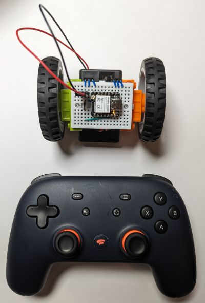

# Control using a Bluetooth gamepad (ESP32, Arduino)

The [Bluepad32](https://github.com/ricardoquesada/bluepad32) library makes it possible to steer your ESP32-enabled BreadboardBot with pretty much any Bluetooth gamepad.

The two microcontrollers this example has been tested with so far are the [M5Stack Atom Lite](https://shop.m5stack.com/products/atom-lite-esp32-development-kit) and the [Xiao ESP32S3](https://www.seeedstudio.com/XIAO-ESP32S3-p-5627.html).

* **Wiring**

  If you have the Xiao ESP32S3, use the [base assembly wiring](../assembly.md). If you have the M5Stack Atom, use the [M5Stack Atom line follower wiring](m5atom_line_follower.md), except you do not need the line sensors (as well as any accompanying wiring on the right side of the breadboard). 

* **Programming**

  The code for this example is given in [code/arduino/Bluepad](https://github.com/konstantint/BreadboardBot/tree/main/code/arduino/Bluepad). You can either use the Arduino IDE or the Arduino CLI to compile and upload it to your microcontroller.

  * If you are using the M5Atom, edit `Robot.h` and uncomment the line `#define M5ATOM`. 
  * If you are using the Arduino IDE:
    * Add `ESP32` and `Bluepad32 + ESP32` board packages as described [here](https://github.com/ricardoquesada/bluepad32/blob/main/docs/plat_arduino.md#option-a-create-an-arduino-core-for-esp32--bluepad32-library).
    * Install the `ESP32Servo` and `Adafruit NeoPixel` libraries.
    * Open `Bluepad.ino` in the Arduino IDE.
    * Choose the correct board (`esp32_bluepad32 -> XIAO_ESP32S3` or `esp32_bluepad32 -> ESP32 PICO-D4` for M5Atom).
    * Choose the correct port.
    * For M5Atom, set UploadSpeed to 115200.
    * Upload the sketch.
    * If uploading fails, sometimes you might want to connect the MCU to USB while holding down BOOT (on ESP32S3) or RESET (on M5Atom).
  * If you are using the Arduino CLI:
    * Run `arduino-cli compile -m <platform>` to compile the code where `<platform>` is `esp32s3` or `m5atom`.
    * Run `arduino-cli upload -m <platform> -p <port>` where `<port>` is the correct port (you can often find it by looking at the output of `arduino-cli board list`)

* **Result**
  
  Turn on the robot, then turn on your gamepad and set it into pairing mode. It should auto-pair with the robot (the LED will switch off (ESP32S3) or change color (M5Atom)). You can use the left & right sticks to drive the robot around.
