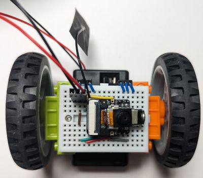
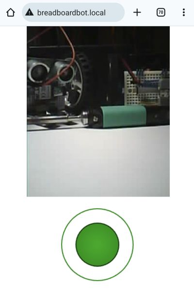

# Web-steerable FPV robot (ESP32S3 Sense, Arduino)

This is an Arduino-based version of the [Web-based control](esp32s3_http_control) example for the [Xiao ESP32S3Sense](https://www.seeedstudio.com/XIAO-ESP32S3-Sense-p-5639.html) microcontroller with improved UI.

* **Wiring**

  Use the [base assembly](../assembly.md) wiring.

* **Programming**

  * The code is under [WebFPV](https://github.com/konstantint/BreadboardBot/tree/main/code/arduino/WebFPV).
    * If you are using GeekServo motors, edit `config.h` and uncomment `#define MOTORS_GEEKSERVO`.
    * Optionally, edit `WebFPV.ino`, comment out `setupWifi()` and instead uncomment the line `// setupWifi(false, "<SSID>", "<password>");`, substituting the correct SSID and password. Otherwise the robot will start an access point named `BreadboardBotFPV`.
  * Using Arduino CLI:
    * Run `arduino-cli compile --log` (in the `WebFPV` folder).
    * Connect the MCU to USB while holding the BOOT button and run `arduino-cli upload -p <port>`. Release the BOOT button when the upload starts.
  * Using Arduino IDE:
    * Install the `ESP32` board and the `ESP32Servo` library.
    * Open `WebFPV.ino`, choose the `esp32->XIAO_ESP32S3` board, select `Tools->PSRAM->OPI PSRAM`, choose the correct port, then compile & upload the sketch. You will probably need to hold the BOOT button while connecting the board and waiting for the upload to start.

* **Result**

  If you configured the robot to connect to your Wifi, open `breadboardbot.local` on your smartphone and have fun steering it.

  If you did not configure the robot to connect to your Wifi, then connect to the `BreadboardBotFPV` access point with your smartphone and go to `192.168.4.1` (for some reason mDNS does not seem to work for me in access point mode).

  As in the [CircuitPython ESP32S3Sense example](esp32s3_http_control.md) this is an impractical proof of concept demonstration, as the MCU heats up and consumes the battery quickly, which can result in disconnects or disappearing camera image after prolonged (> 10 minutes) use.
