# Basic line follower with DC motors

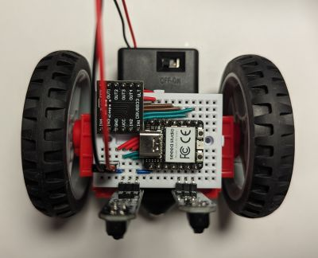
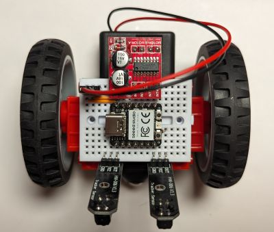

It is possible to build a version of BreadboardBot that uses DC motors rather than continuous servos. DC motors sometimes tend to allow slightly more precise steering (or at least cost less for an equivalent level of quality). In particular, the  (follow-up) [self-balancing exercise](hbridge_self_balancing.md) is notably easier with DC motors.

The motors will need to be connected via a dedicated driver (L298N or DRV8833 in this example). The need to have an extra board along with additional wiring leaves less room for other gadgets.

## Parts

In this example we will be using small "GeekServo" DC motors instead of the continuous rotation servos. To drive the motors we will use either the L298N or the DRV8833 breakout board listed below:

| **Image**&nbsp;&nbsp; | **Component** | **Price** | **Notes** |
| --------------------- | ------------- | --------- | --------- |
| 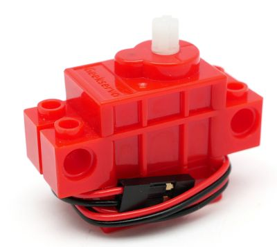 | 2 x [GeekServo "Red" DC motor](https://aliexpress.com/item/33010305970.html) | $6 | This [DC Motor in Micro Servo body](https://www.adafruit.com/product/2941) by Adafruit is a (non-LEGO-wheel compatible) alternative.
| 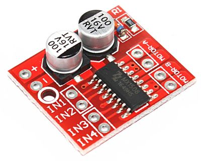 | [Mini L298N board](https://aliexpress.com/item/1005005326813422.html) | $0.4 | The mini L298 board attaches to the MCU without any extra wiring at all, however the pinheaders will need to be soldered in a slightly "skewed" manner.
| 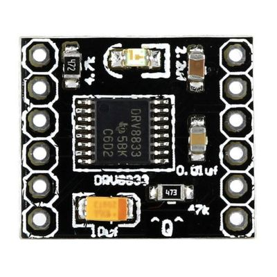 | **or** [DRV8833 board](https://www.aliexpress.com/item/1005006208060940.html) | $0.9 | A bit more wiring is needed to attach DRV8833.

## Assembly & wiring: DRV8833

You can start assembly by first wiring the breadboard:

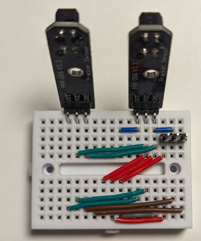

Then plug in the Xiao RP2040 and the DRV8833 as follows:

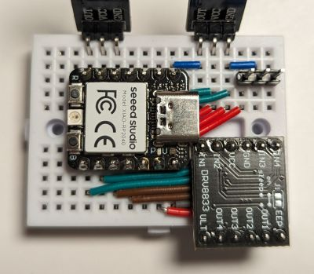

Next, stick the motors to the back of the breadboard, connecting to the DRV8833 outputs. You may hot glue the motor contacts to the side of the breadboard (as was done for the standard BreadboardBot), however they might hold well enough without that.

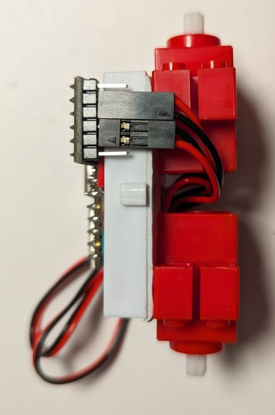

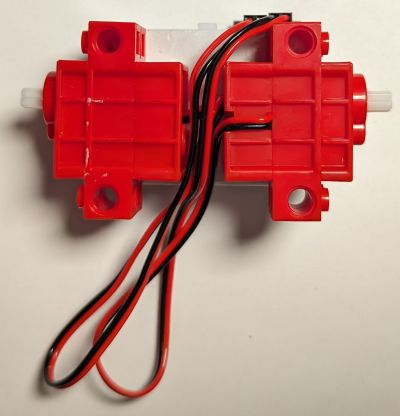

Finally, package the wires between the motors and stick the battery box (with or without the caster ball) to the back, as was done in the base assembly of the standard BreadboardBot.

## Assembly & wiring: L298N

You can start assembly by first wiring the breadboard:

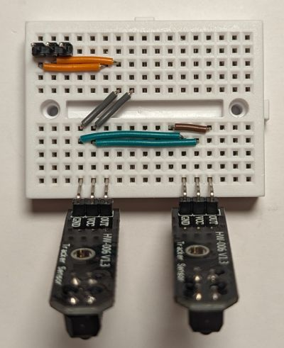

Then plug in the Xiao RP2040 and the L298N as follows:

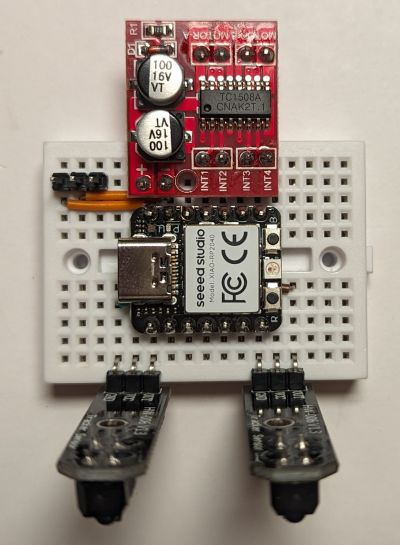

Note that you might want to solder the pinheaders to the L298N *after* you plug them into the breadboard. The holes in the board do not perfectly align with the breadboard but are close enough to be able to skew the pinheaders slightly.

Make sure the (+, -) on the L298N align with the 5V, GND on the MCU and the (INT1, INT2, INT3, INT4) match the (D10, D9, D8, D7).

Then stick the motors and the battery to the back, packing the wires compactly, and plug the motors into the L298N board:

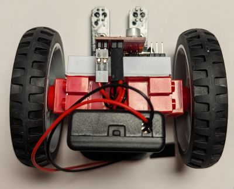

NB: Plug the *right* motor into the *left* two pins and the left motor into the right two pins (this is necessary to keep using the same code with either driver board)

## Programming

If you are using the DRV8833 wiring, edit `breadboardbot/platform_rp2040_hbridge.py` change `line_left_pin=` to `board.D6`.

Then change `code.py` to be just `import hbridge_ex02_line_follower`.

## Result
  
<iframe width="640" height="390" frameborder="0" allowfullscreen
        src="https://www.youtube.com/embed/8-w4K21s5hc">
</iframe>

## Bluetooth gamepad control

The Xiao ESP32S3 Arduino Bluetooth gamepad steering code from [this example](bluepad32.md) can be built to control this robot model - just uncomment `#define MOTORS_DC` in `config.h` before compiling.