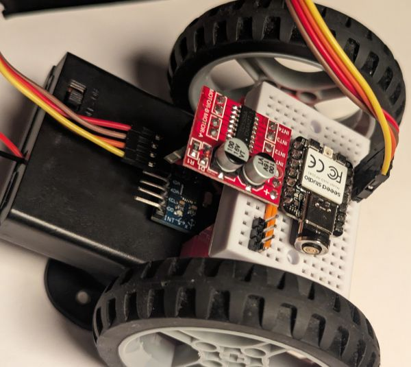

# Self-balancing on DC motors

In an attempt to [self-balance the BreadboardBot on its stock servo motors](self_balancing_bt.md) one quickly discovers that the robot is inherently quite unstable due to the choice of motors and its overall construction. Let us try to make stabilizing it more pleasant by relying on the following tricks:

* Use DC motors instead of servos for smoother control.
* Use 4xAAA (fully charged) batteries to provide more power.
* Attach the battery box higher to raise the center of gravity.
* Attach the MPU closer to the center of mass to have it shake less and get a cleaner signal. 

* **Building and wiring**
  
  * Start with the L298N variant of the [DC-motor line follower example](hbridge_line_follower.md).
  * Use a 4xAAA battery box, remove the caster wheel if you had one, and (re)stick it as high as possible:

    

  * Stick the MPU-6050 to the front of the battery box and wire its VCC, GND, SDA, SCL pins to the microcontroller using four male-to-female DuPont jumpers:
    
    
  
  Note that the wiring prepared for the line sensors conveniently exposes VCC and GND right next to the SDA and SCL pins as needed.

  Unlike in the original self-balancing example we do not have a Bluetooth dongle here to enable realtime tuning of the PID coefficients. However, the range of parameters which will keep the robot upright is much wider here, so tuning can be done reasonably quickly by just plugging the robot in, changing the values, saving the file and trying them out. I managed to find a working combination in about half an hour of such attempts.
  
  The magnetic USB cable (its plug you see on the image above) is quite handy here.

* **Programming**
  
  Change `code.py` to be just `import hbridge_ex03_self_balancing`. You will probably need to change the PID parameters in this file multiple times until you find ones which keep your robot balanced.

* **Usage**
  
  Turn on the robot and hold it in a balanced position for 3 seconds to calibrate. It will then start attempting to maintain this position. If you did not hold it straight enough during the calibration period, it will drive off backwards or forwards and eventually fall rather than keeping balance - in this case just switch it off and on again to repeat the calibration.

  [Here](https://youtu.be/ivGLBxfS5SU) is how the result may look like.