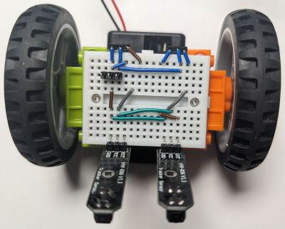
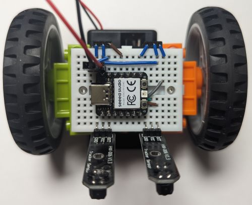

# Basic line follower

* **Wiring**

  Starting from the [base assembly](../assembly.md), plug two line tracking sensors and wire them to the microcontroller using three extra wires (S1, S4, S6) as follows:

  

  Note that this wiring is not ideal, as, in its strive for simplicity, it powers the left line sensor from 5V. This sensor then sends the 5V positive signal to the microcontroller's D10 pin. GPIO pins of the Xiao RP2040 are not designed to be 5V-tolerant. However, the setup seems to work in practice, at least for short test sessions on the Xiao RP2040 (I did not try this with other microcontrollers and do not recommend you try it either). Note that if you use three rechargeable AAA batteries, the "5V" will actually be around 4V, which is a bit closer to safe voltage limits (although still outside of the officially specified tolerance).

  If you want to have an absolutely correct wiring, see "alternative wiring" below.

* **Programming**
  
  Change `code.py` to be just `import ex02_line_follower`.

* **Result**
  
  The resulting robot should behave somewhat [like that](https://youtu.be/DHixDNT65I0).

## Alternative wiring

If you want to avoid feeding 5V to the input pin of a microcontroller you can consider a different wiring. For example, something like that would work:

This wiring requires the microcontroller to be plugged in as follows:

You will also need to update `breadboardbot/platform_rp2040.py` to use different pins:

* Line sensor pins: left=D6, right=D1.
* Motor pins: left=D7, right=D10
* Remove the `self.keys = ` line to free up D1.

Finally, the follow-up line-follower examples (those using the sonar or the OLED) will not work with this wiring (and are probably rather difficult to adapt).

