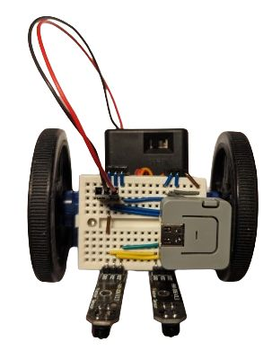
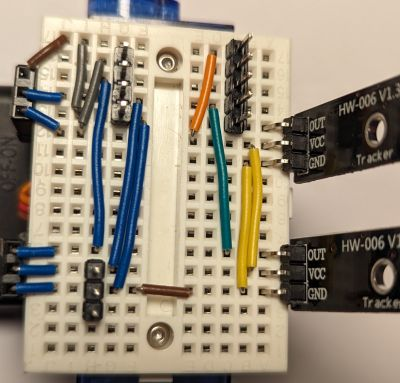
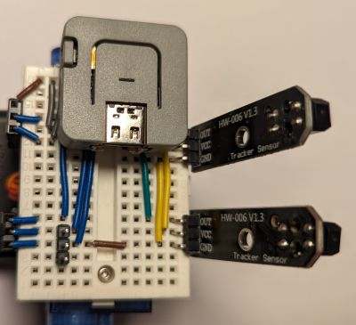

# M5Stack Atom: Basic line follower

This is an example of a BreadboardBot that uses the [M5Stack Atom Lite](https://shop.m5stack.com/products/atom-lite-esp32-development-kit) microcontroller and the [ESPHome](https://esphome.io/) platform as the programming environment.

* **Wiring**

  The base assembly wiring was aimed at a Xiao microcontroller and is completely unsuitable for the M5Stack Atom. Wire your breadboard (for example) as follows instead:

  

  Note the 4-wide and 5-wide (long) pinheaders for plugging in the Atom Lite. With the microcontroller the board will look as follows:

  

* **Programming**
  
  Create a new device in ESPHome, paste [this config](https://github.com/konstantint/BreadboardBot/tree/main/code/esphome/m5atom_line_follower.yaml), make sure you have all the necessary values defined in your `secrets.yaml`, then install it in your device.

* **Result**
  
  Here is a [video](https://youtu.be/XpShH5Vs8lY) of the resulting robot.
