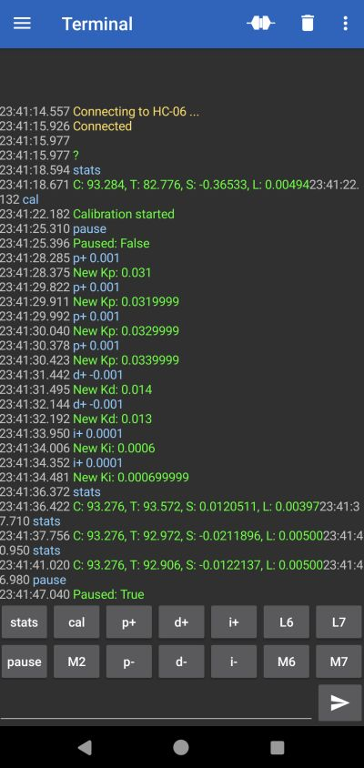

# Self-balancing with MPU-6050 and Bluetooth serial

Making a self-balancing two-wheeled robot is a classical fun introductory robotics exercise.

As the BreadboardBot was not built with the intention of balancing on two wheels, this exercise can be a bit more challenging than for a more typical self-balancing platform, and the result is much more fragile. Unlike most other examples here, just wiring your robot and copying the example code most probably will not suffice and you will need to tune the parameters to match your own robot. This, however, provides a particularly valuable and insightful learning experience. 

Let us first review the reasons that make the BreadboardBot challenging to balance:

1. The used servo motors are not too precise. For example, at throttle value 0.03 your left motor might not yet start moving yet at -0.01 it already would, and for the right motor these values would be different. You might need to tune the `motors.drive` function a bit to use a suitable offset for each motor, however that offset seems to be sensitive to the battery voltage, so there is a limit to how much these calibration efforts will help. In addition, when a motor starts moving at some threshold, it might do so with a tiny jerk, which negatively affects stabilization.
   
   These are probably the reasons you will not find too many self-balancing robots built with servo motors. Indeed, balancing the [BreadboardBot on DC motors](hbridge_self_balancing.md) can be notably simpler.

2. The motors we use are rather weak. You will certainly need 4xAAA batteries, because three just do not seem to provide enough power. Moreover, when I used four rechargeable AAA batteries, they were only good for a short while after recharging: as the total voltage dropped below 5.3V or so, the robot would struggle to maintain balance no matter how much I tuned the PID coefficients. Non-rechargeable alkaline batteries are a bit more convenient here as they keep their total voltage high enough for longer.

3. The robot has a low center of mass. The lower the center of mass, the harder it is to balance an inverted pendulum in general. When combined with the weakness of the motors, this leaves a rather small range of tilt angles, from which the robot is able to recover balance in principle. A few accidental jerks due to (1) can easily take it out of this range.

4. The robot is asymmetric and seems to accelerate faster when falling towards the back rather than towards the front. Probably because of that, equal jerking of the wheels back and forth seems to tend to gradually destabilize it towards the back.
  
5. As the MPU-6050 is plugged into the breadboard right next to the wheels, it picks up all of the the wheel-caused acceleration signal, which makes it nearly impossible to use the pure accelerometer signal for balancing (which is often a viable easy solution in robots where the MPU is positioned higher up or close to the center of mass).

With those observations in mind, let us none the less proceed.

* **Building and wiring**

  The build and breadboard wiring for our robot is the same as in the [OLED & Bluetooth example](oled_bluetooth.md) with the following changes:

  * As mentioned above, your robot must have a 4xAAA battery box. 
  * Instead of the OLED we will plug in the MPU-6050 sensor as follows. Note that you must only solder the 4 pin headers (SDA, SCL, GND, VCC) onto the MPU6050 board, leaving the other pins unsoldered.

    

    You may notice the magnetic USB cable plug inserted in the MCU on the image. Having one is extremely handy in this exercise.

  * The balancing position of the robot is with the breadboard looking downwards, leaving no space for neither the Bluetooth module nor the battery plug to stick out downwards. For the battery connector, take three long (~21mm) male pinheaders, twist them, and plug the battery on the right of the MPU as shown above. For the Bluetooth module do the same trick, twisting the pin headers even further backwards. Stick the module to the back of the battery box and connect to the twisted pin headers using four female-to-female DuPont jumpers:

    
    

* **Programming**
  
  Change `code.py` to be just `import ex11_self_balancing_bt`. You should also read through and understand `ex11_self_balancing_bt.py` as you might need to adapt it.

* **Usage**
  
  Install the [Serial Bluetooth Terminal](https://play.google.com/store/apps/details?id=de.kai_morich.serial_bluetooth_terminal) app, launch it. Go to `Settings->Misc`, Change "Macro buttons" to `2 rows`. Go to `Settings->Receive`, configure `Newline` to `LF`. Then go to the main screen and confugure the macro buttons at the bottom (long press) to send the commands defined in `ex11_self_balancing_bt.py`.
  
  I found having the following macros convenient:

  * Buttons `stats`, `cal`, `pause` configured to send respective commands. 
  * Buttons `p+` and `p-` configured to send strings `p+ 0.001` and `p+ -0.001`.
  * Buttons `d+` and `d-` configured to send strings `d+ 0.001` and `d+ -0.001`.
  * Buttons `i+` and `i-` configured to send strings `i+ 0.0001` and `i+ -0.0001`.
  
  Now pair the `HC-06` device and connect to it (the robot must be turned on). Try the `stats` command to verify things work. Then hold the robot steady in a balanced position and click `cal`. The robot takes 3 seconds to calibrate itself. Then click `pause` to disable the pause mode and observe the robot struggle to maintain balance. While it is doing so you may tune the PID coefficients using the `p+/p-/d+/d-/i+/i-` buttons. If you happen to find the coefficients that work for you, you will need to specify them in `ex11_self_balancing_bt.py`. Note that the coefficients are sensitive to battery voltage, so whatever you discover while your batteries were fully charged might not work as well as they discharge! 

  Here is how a typical "configuring" session could look like (except it is usually much longer than a single screen).

  

* **Result**

  Here is the sort of self-balancing I managed to achieve within an evening or so of tuning attempts. The robot does hold itself in place reliably, but is barely able to recover from even the lightest disturbances. Could you do better?

  <iframe width="640" height="390" frameborder="0" allowfullscreen
          src="https://www.youtube.com/embed/Jx0uGfr_hds">
  </iframe>

  Balancing is much easier [on DC motors](hbridge_self_balancing.md).