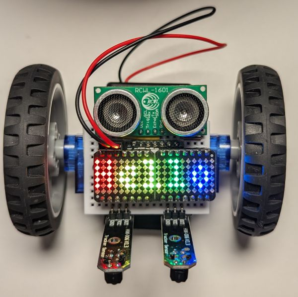

# Xiao RGB Matrix

The [Xiao RGB Matrix](https://www.seeedstudio.com/6x10-RGB-MATRIX-for-XIAO-p-5771.html) is a cute add-on for the Xiao microcontroller. It is intended to be plugged *into the back* of the microcontroller, but with a couple of long pin headers we can plug it into our breadboard suspended right above our microcontroller.

This example looks nice on its own on the breadboard as well, without the wheels and all other parts of the robot.

NB: the RGB matrix does not seem to work correctly when powered with more than 5.5V, which may be the case if your robot was built with a 4xAAA battery box and your NiMH batteries are fully charged. 

* **Wiring**

  The photo and wiring diagrams below show how to add the RGB matrix to the [Sonar line follower](line_follower_sonar.md) wiring configuration, but you can just as well start with the [base assembly](../assembly.md).
  
  The RGB matrix needs to be connected to GND, 5V and an output pin (D9 in our example). We need two pairs of long (17mm or longer) pin headers. The pair on the left will be connected to GND and 5V. The top pin from pair on the right needs to be wired to the output pin.

  

  Then plug the RGB matrix (with its standard female connectors soldered) onto the four pins, making sure it is correctly oriented - verify the labeling for 5V, GND and IN on the board.

* **Programming**
  
  Change `code.py` to be just `import ex10_rgb_matrix`.

* **Result**
  
  The resulting robot is a version of the sonar-equipped line follower that also makes use of the RGB matrix (first scrolls some text, then shows a selection of rainbow effects). Here is the video of just the animation:

  <iframe width="640" height="390" frameborder="0" allowfullscreen
          src="https://www.youtube.com/embed/A6sq72KMCfU">
  </iframe>

## Two RGB matrices

If you have two RGB matrices you can attach them both to form a longer "screen":

You can use the following wiring to attach the left matrix to pin D8 and the right one to D9 (while still supporting two line sensors and a sonar):

